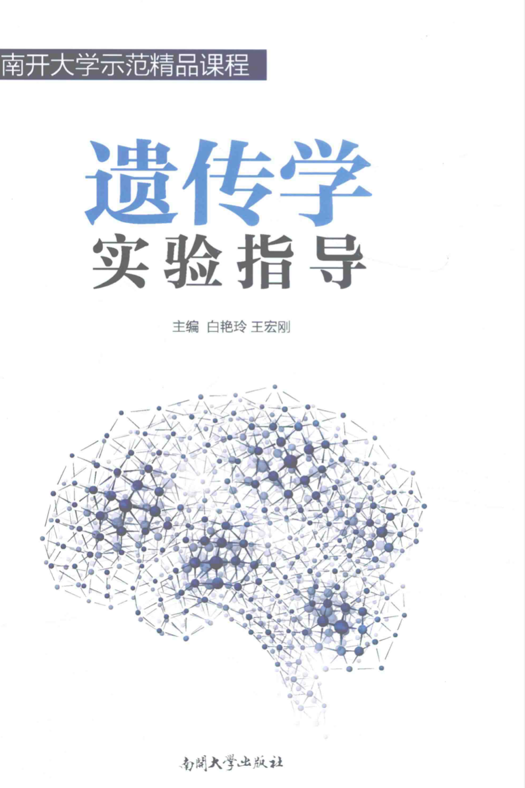

# 必选-遗传学

## 什么是必选课

必选课与选修课不同，必选课是在限定的几门课中，至多有2门课可以不休。（多修这两门算D类选修学分）

伯苓班、生物科学是8选6，生物技术是9选7.

属于前者的必选课：植物学、动物学、植物生理学、动物生理学、细胞生物学、微生物学、分子生物学、遗传学。**(均含实验课)**

属于后者的必选课：植物学、动物学、细胞生物学、遗传学、微生物学 **（此五门含实验课）** ；微生物发酵工程、开放实验专题I、基因操作原理、分子生物学实验 **（无理论课）** 。

--W.M. 2021

## 理论课

### 陈德富老师

陈老师负责讲前半部分，说话有一些口音所以需要仔细听，PPT较老，建议多自学。

--W.M. 2021

### 朱正茂老师

朱老师负责后半部分，上课有激情，喜欢抽人回答问题，紧张刺激，最后会有一次展示，我们当年是他抽几个Chapter出来，一个小组（2人）负责讲一个Chapter。

--W.M. 2021

## 实验课

### 伯苓班

教材是：**遗传学实验指导**，南开大学出版社

教材可能存在版权问题就不放电子版了，网上找找，白色封面。

实验比较多，最难的部分是做**核型分析**，即班上找几位志愿者献血，然后大家对血细胞滴片，光镜拍照，进行核型分析，排好46条染色体。

--W.M. 2021

## 理论课（生科生技大类三个平行班之一）

### 吴世安老师

负责前半部分的讲解，老师稍微有点口音，但不妨碍听课，讲解挺清楚的，每章过后都会留几道课后题（很正的题，基本囊括了这一章的重点内容，需要真正搞懂），下次上课发答案。ppt也是每章讲完之后发给大家。

### 李明刚老师

负责后半部分的讲解，第一次上课前会把后面所有章节的ppt和习题一次性发给大家，讲解也很清楚到位。最后会把习题答案一次性发给大家，同样题目都很正，都是每一章的重点内容，没有偏题怪题，最后会流出两三次课的时间不再上课自由复习（虽然感觉课讲的快，但是每节课内容讲的都很到位）

总的来说，两位老师教学经验都很丰富，课堂体验极好；ppt做得没话说，很精良，容易让大家理解，涉及到计算题一定要推这个公式怎么得来的，非常重要（我们这一级期末就涉及到了广义遗传率的推导，普遍得分情况不是太好），一定要把握住；其他两个平行班的老师不太清楚，但是这两位老师我极力推荐！！！

—— 19-ljy
